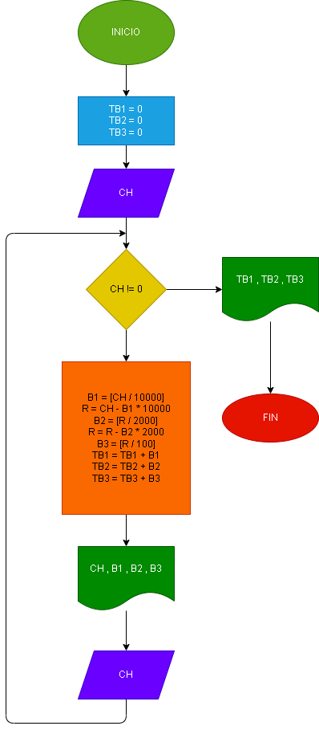

# CAJERO

El cajero de un banco solo dispone de billetes de $10.000, $2.000 y $100. 
su funcion es cambiar los cheques a los clientes. asumiendo que los cheques son multiplos de $100 dar la camtidad de
billetes a emtregar por cheuq y la cantidad de billetes de cada denominacion entregados al dia.

## Diagrama de flujo

